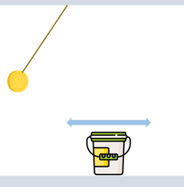
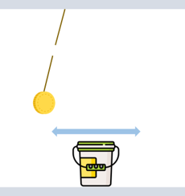
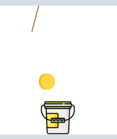

# 2019-2 객체지향 프로그래밍 프로젝트 - **{티끌 모아 태산}**
구성원: 2-2 김윤종 | 2-5 권태희

## 1. 주제

하늘에서 동전이 떨어진다

## 2. 동기

예전에 위쪽에서 원판이 흔들리고, 적절한 타이밍에 원판이 달려있는 줄을 잘라 원판으로 탑을 쌓는 게임을 해본 적이 있다. 당시의 게임은 탑을 꽂아야 하는 막대기 때문에 너무 어렵다고 생각했었다. 이에, 그 게임의 난이도를 조절하여 조금 더 쉽고, 진행함에 따라 조금씩 어려워지는 게임으로 변형해보고 싶었다.

## 3. 프로그램 사용 대상

간단하면서도, 동전(원판)의 운동(포물선)을 현실적으로 표현한 게임을 해보고싶은 플레이어. 
게임을 통해 순발력을 향상시키고 싶은 플레이어.

## 4. 목적

게임은 천장의 끈에 매달린 동전이 진자운동하고, 적절한 타이밍에 줄을 잘라 동전이 바닥에 있는 바구니에 들어가도록 한다. 바구니에 최대한 많은 돈을 모으는 것이 게임의 목적이다.

## 5. 주요기능

a. 게임 오프닝

게임 화면에, 게임 방법과 게임 난이도 구성, 생명에 대한 대략적인 설명이 제시된다. 이후, 플레이어는 입력창에 자신의 플레이 아이디를 입력한다. 입력한 아이디는 게임이 종료된 이후 플레이어의 실적을 기록하는 데 사용된다.
b. 게임 난이도 구성

게임은 easy 모드에서 시작하여, 각 단계를 성공함에 따라 medium, hard모드로 진행하게 된다. easy 모드에서는, 탑이 쌓여감에 따라 떨어뜨리는 동전의 크기가 점차적으로 커진다. 커진 동전은 이전보다 바구니와 충돌할 수 있는 가능성을 높여, 잘 들어가기 힘들게 한다. easy 모드에서는 50원짜리 동전이 총 5개 주어진다. medium 모드에서는 easy 모드의 사양을 모두 포함하는 동시, 떨어뜨리는 동전의 진동 주기가 점차 짧아진다. medium 모드에서는 총 7개의 100원짜리 동전을 모아야 한다. hard모드에서는 medium모드의 사양을 모두 포함하는 상태에서, 동전을 모아야 하는 목표 지점이 좌우로 이동한다. 동전을 모아감에 따라, 동전을 떨어뜨려야 하는 목표 지점의 이동이 조금씩 빨라지게 된다. hard모드에서는 9개의 500원짜리 동전을 모아야 성공이다.
c. 게임 방법

화면의 바닥에는 동전을 모아야 하는 목표 지점인 바구니가 주어지고, 화면의 천장에는 떨어뜨려야 하는 동전과 그것을 매다는 실이 주어진다. 실은 설정된 주기로 좌우진동하며 동전을 진자운동시킨다. 플레이어가 enter 키를 누르면 실이 끊어지면서, 동전이 포물선 운동을 하며 떨어지게 된다. 바구니에 동전이 들어가면 그 동전의 금액만큼 수익이 올라간다.
d. 생명

동전을 받는 것을 실패하는 경우, 생명이 하나씩 줄어들게 된다. 생명은 게임을 시작할 때 기본적으로 3개 주어지고, easy 모드를 성공하면 생명이 한 개 추가되며, medium 모드를 성공하면 생명이 한 개 더 추가된다. 모든 생명이 줄어들면 게임은 종료되고, 실적 기록이 진행된다.
e. 실적 기록 및 랭킹 표시

게임을 시작할 때 입력한 아이디로, 자신의 실적이 랭킹화되어 기록된다. 랭킹 보드에 표시되는 정보는 플레이어의 게임 아이디, 진행한 단계(easy/medium/hard의 동전을 총 얼마모았는지), 남은 생명 개수(동전을 전부 넣었을 경우), 소요 시간이 표시된다. 정렬의 우선순위는 진행한 단계, 남은 생명 개수, 소요 시간의 순서이다.
f. 다시 플레이할지 선택

랭킹보드가 보여진 이후, 사용자는 다시 플레이할 것인지 선택할 수 있게 된다. 다시 플레이하면 기존의 랭킹 보드에 새로운 실적이 추가되고, 다시 플레이하지 않음을 선택하면 게임이 종료된다. 게임 종료 이후 기존의 랭킹 보드는 모두 초기화된다.

## 6. 프로젝트 핵심

## 7. 구현에 필요한 라이브러리나 기술

pygame
: 게임을 형성하기 위해 사용한다. 1) 동전, 바구니 등을 구현하고, 2)제어키 (엔터키)

vpython
: 물리엔진이다. 이 기능을 가지고 1) 매달아놓은 동전의 진동, 2) 줄을 끊은 후 동전의 포물선 운동, 3)동전이 바구니에 들어가는 운동을 현실적으로 구현한다. 

## 8. **분업 계획**
아직

## 9. 기타
easy 모드에서의 동전 클래스를 상속하여 medium 모드의 동전클래스를 만들고, medium 모드의 동전 클래스를 상속하여 hard모드의 동전 클래스를 구성한다.
게임 진행은 처음 사용자 이름을 입력한 후, 이를 이용해 player class를 새로 만든다. 게임 결과 (시간, 도달 단계)를 해당 객체에 저장하고, 마지막에 정렬하여 leaderboard

#### readme 작성관련 참고하기 [바로가기](https://heropy.blog/2017/09/30/markdown/)

#### 예시 계획서 [[예시 1]](https://docs.google.com/document/d/1hcuGhTtmiTUxuBtr3O6ffrSMahKNhEj33woE02V-84U/edit?usp=sharing) | [[예시 2]](https://docs.google.com/document/d/1FmxTZvmrroOW4uZ34Xfyyk9ejrQNx6gtsB6k7zOvHYE/edit?usp=sharing) | [[예시 3]](https://github.com/goldmango328/2018-OOP-Python-Light) | [[예시4]](https://github.com/ssy05468/2018-OOP-Python-lightbulb) | [[모두보기]](https://github.com/kadragon/oop_project_ex/network/members)
